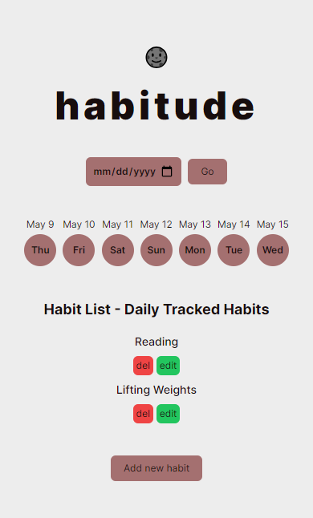
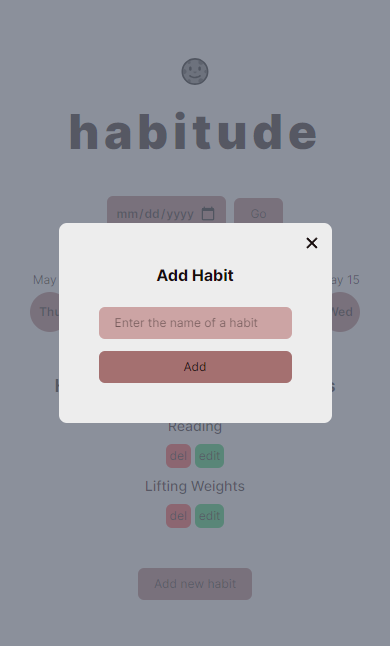
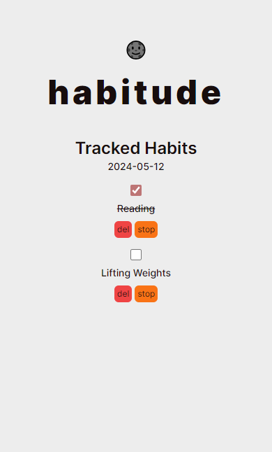
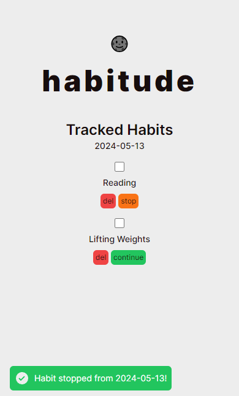

# Habitude

[**habitude**](https://beniusis.github.io/habitude) is a habit 🔁 tracking 📝 application that helps people stick to new daily habits, such as working out, reading, meditating and more.

## Table of Contents

- [Overview](#overview)
  - [Features](#features)
  - [Technologies and Tools](#technologies-and-tools)
  - [Screenshots](#screenshots)
- [Setup the Development Environment](#setup-the-development-environment)
  - [Install the required dependencies](#install-the-required-dependencies)
  - [Compile and Hot-Reload for Development](#compile-and-hot-reload-for-development)
  - [Lint and format](#lint-and-format)

## Overview

### Features

- **Navigation**: users are able to navigate between days to view the habits they completed on any specific day.
- **Habit List**: displays all daily habits. Users are able to mark or unmark them as completed in the specific day's view.
- **Habit Management**: users are able to edit, stop, and delete habits. Editing a habit changes the habit's name. Stopping a habit removes it from the habit list from that point forward. Deleting a habit removes it from the habit list and deletes all of its daily records.
- **Dynamic Routing**: users are able to navigate between days by entering specific date in the URL (e.g. /day/2025-05-10).
- **Dark Mode**: users are able to switch between light/dark theme modes.
- **Responsive Design**: ensuring a seamless user experience across all devices.

### Technologies and Tools

- 🖼️ **Framework**: [Vue](https://vuejs.org)
- 😎 **Styling**: [Tailwind CSS](https://tailwindcss.com)
- 🗺️ **Routing**: [Vue Router](https://router.vuejs.org)
- 🍍 **State Management**: [Pinia](https://pinia.vuejs.org), [VueUse](https://vueuse.org)
- ✨ **Code Quality**: [ESLint](https://eslint.org), [Stylelint](https://stylelint.io), [Prettier](https://prettier.io)
- 🏗️ **Build Tool**: [Vite](https://vitejs.dev)

### Screenshots






## Setup the Development Environment

### Install the required dependencies

```sh
npm install
```

### Compile and Hot-Reload for Development

```sh
npm run dev
```

### Lint and format

```sh
npm run lint
```

```sh
npm run lint:style
```

```sh
npm run format
```
